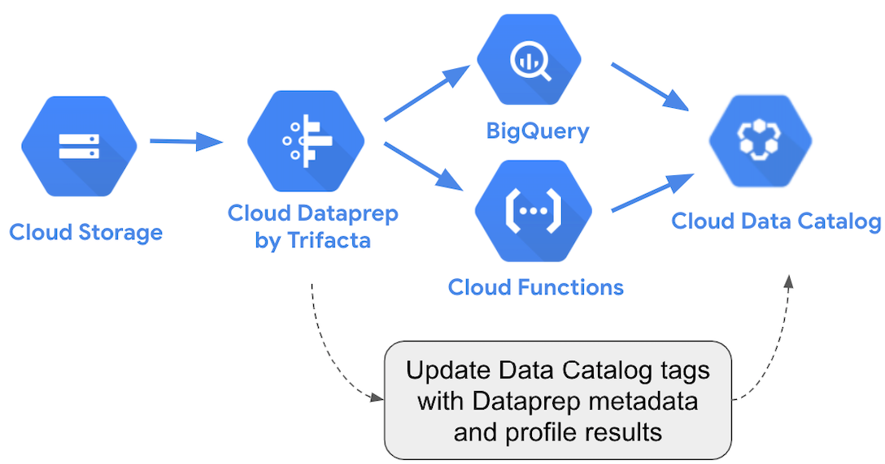

# google-data-catalog-dataprep

Create or update [Google Cloud Data Catalog](https://cloud.google.com/data-catalog/) tags on BigQuery tables with [Cloud Dataprep](https://cloud.google.com/dataprep) Metadata and Column Profile via a [Cloud Function](https://cloud.google.com/functions).

The 2 Data Catalog tags created or updated:
- **Dataprep Metadata** tag attached to the BigQuery table and containing information from the Dataprep job used to create or update the BigQuery table : the user, Dataprep Job (id, name, url, timestamp), Dataprep Dataset (id, name, url), Dataprep Flow (id, name, url), Job Profile (url and nb valid, invalid an empty values) and the Dataflow job (id, url).
- **Dataprep Column Profile** tag attached to all BigQuery table columns and containing number of valid, invalid and empty values for each column.

To activate, learn and use Cloud Data Catalog, go to https://cloud.google.com/data-catalog/ and https://console.cloud.google.com/datacatalog.

This repository contains the Cloud Function Python code triggered from a [Dataprep Webhook](https://docs.trifacta.com/display/DP/Create+Flow+Webhook+Task) to create or update 2 Data Catalog tags.

In your Cloud Function, you need the 5 files:
- [main.py](https://github.com/victorcouste/google-data-catalog-dataprep/blob/main/main.py)
- [config.py](https://github.com/victorcouste/google-data-catalog-dataprep/blob/main/config.py) where you need to update your **GCP project name** (where Tags Template are created) and the **Dataprep Access Token** (to use Dataprep API).
- [datacatalog_functions.py](https://github.com/victorcouste/google-data-catalog-dataprep/blob/main/datacatalog_functions.py)
- [dataprep_metadata.py](https://github.com/victorcouste/google-data-catalog-dataprep/blob/main/dataprep_metadata.py)
- [requirements.txt](https://github.com/victorcouste/google-data-catalog-dataprep/blob/main/requirements.txt)

This Cloud Function uses:
- [Python Client for Google Cloud Data Catalog API](https://googleapis.dev/python/datacatalog/latest/index.html#)
- [Cloud Dataprep REST API](https://api.trifacta.com/dataprep-premium/index.html)

Before runing the Cloud Function (and create or update tags), you need to create the 2 Data Catalog Tag Templates for Dataprep (Metadata and Column Profile).
You can use:

- **gcloud** and the command `gcloud data-catalog tag-templates create`, full command lines in [gcloud_tag-templates_create.sh](https://github.com/victorcouste/google-data-catalog-dataprep/blob/main/gcloud_tag-templates_create.sh), more details with and [example](https://cloud.google.com/data-catalog/docs/quickstart-tagging#data-catalog-quickstart-gcloud) and [reference](https://cloud.google.com/sdk/gcloud/reference/data-catalog/tag-templates/create).

- **REST API** with the 2 tag template json files [dataprep_metadata_tag_template.json](https://github.com/victorcouste/google-data-catalog-dataprep/blob/main/dataprep_metadata_tag_template.json) and [dataprep_column_profile_tag_template.json](https://github.com/victorcouste/google-data-catalog-dataprep/blob/main/dataprep_column_profile_tag_template.json), more details with an [example](https://cloud.google.com/data-catalog/docs/quickstart-tagging#data-catalog-quickstart-drest) and [reference](https://cloud.google.com/data-catalog/docs/reference/rest/v1/projects.locations.tagTemplates/create).

When Data Catalog template tags are created and when tags are created or updated on BigQuery tables, you can find all results from https://console.cloud.google.com/datacatalog.

Happy tagging !
